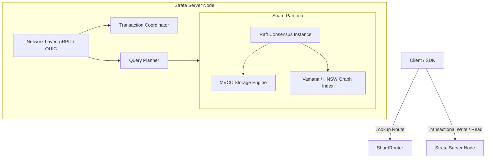

# STRATA 🚀

STRATA is a sharded, consensus-native, distributed vector database built from scratch in Rust. It is designed to run natively on Apple Silicon with hardware-accelerated ARM NEON SIMD vector distance calculations, robust multi-version concurrency control (MVCC), and a zero-dependency Multi-Raft sharding architecture.

## Why STRATA?

Modern AI applications require fast, reliable, and highly scalable vector search. Many existing vector databases are built on single-node engines wrapped in distributed layers, or depend on thick, complex external consensus or storage engines.

**STRATA** is built from the ground up to address this directly:
- **Consensus-Native**: Every partition (shard) runs its own integrated Raft consensus group.
- **MVCC-Aware Storage**: Keys are versioned with Hybrid Logical Clock (HLC) timestamps to support transactional reads/writes and atomic cross-shard commits (Percolator-style 2PC).
- **Out-of-Core Graph Indexing**: Implements Vamana disk-backed graphs for massive datasets that exceed memory limits, alongside standard in-memory HNSW graphs.
- **Apple Silicon Optimized**: Accelerated distance metrics using NEON SIMD intrinsics with clean, compile-time and runtime safe fallbacks.

---

## High-Level Architecture

---

## Workspace Roadmap & Status

| Phase | Description | Status | Target Crate(s) |
|---|---|---|---|
| **Phase 0** | Scaffold workspace, Architecture docs, CI, TLA+ setup | **Completed** | (Root) |
| **Phase 1** | MVCC Storage Engine (Versioned Keys, LSM/WAL/SSTable) | **Completed** | `strata-storage` |
| **Phase 2** | Raft Consensus (Elections, Log Replication, snapshot compaction) | **Completed** | `strata-consensus` |
| **Phase 3** | Range Sharding & Rebalancing (Joint Consensus, Splits/Merges, Router) | **Completed** | `strata-sharding` |
| **Phase 4** | In-Memory HNSW Graph Index (Cosine/L2, NEON SIMD) | *Planned* | `strata-index`, `strata-simd` |
| **Phase 5** | Out-of-Core Vamana Graph Index (Mmap Graph Layout) | *Planned* | `strata-index` |
| **Phase 6** | Percolator Transactions (2PC, Lock resolution, HLC) | *Planned* | `strata-txn` |
| **Phase 7** | Query Planner & Client SDK (Routing, Merging KNNs) | *Planned* | `strata-planner`, `strata-client` |
| **Phase 8** | Network Layer (gRPC/QUIC, Node Server Daemon) | *Planned* | `strata-net`, `strata-server` |
| **Phase 9** | Benchmarks & Jepsen/Simulation Testing | *Planned* | `strata-bench`, `strata-fuzz` |
| **Phase 10** | TLA+ Verification of Rebalancing Protocol | *Planned* | `tla/` |

---

## Core Components Reached

### 🧱 Shard Routing & Load Rebalancing (`strata-sharding`)
- **Range Partitioning**: The keyspace is divided dynamically into sorted range routes `[start_key, end_key)`.
- **Meta Shard Replication**: Routing routes are stored and replicated on a dedicated meta range (Shard 0) using its own Raft group consensus.
- **Raft Joint Consensus**: Full support for real two-phase membership changes ($C_{\text{old}} \to C_{\text{old,new}} \to C_{\text{new}}$) to dynamically add or remove replicas without split-brain conditions.
- **Greedy Rebalancing**: Implements a load-evaluating cluster rebalancer that triggers shard moves to achieve optimal load balance among physical nodes.

### 🗳️ Consensus Engine (`strata-consensus`)
- Self-contained custom **Raft implementation** (no external consensus crates).
- Incrementally serializes term, voted_for state, and log entries onto the `strata-storage` WAL.
- Efficient state compaction through database snapshots with log and WAL garbage collection.
- Re-entrant crash recovery via WAL replay on startup.
