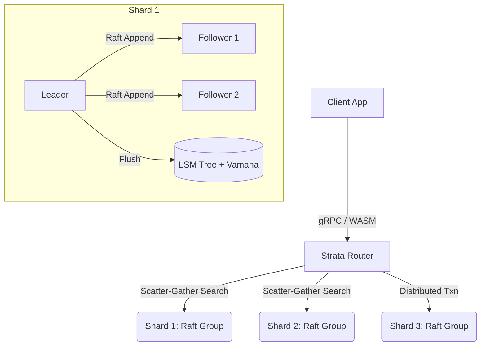

<div align="center">
  
  
  
  

  <h1 align="center">Strata</h1>
  <p align="center">
    <strong>Enterprise-Grade, Formally-Verified Distributed Vector Database</strong>
  </p>
  <p align="center">
    <a href="#-pitch">Pitch</a> •
    <a href="#-architecture">Architecture</a> •
    <a href="#-quickstart">Quickstart</a> •
    <a href="#-benchmarks">Benchmarks</a> •
    <a href="#-formal-verification--deterministic-simulation-testing-dst">Formal Verification</a>
  </p>
</div>

---

## 🚀 Pitch

Traditional vector databases often compromise on consistency or scalability, leaning heavily on eventual consistency models that break under concurrent multi-client updates. **Strata brings enterprise-grade ACID guarantees to the world of Approximate Nearest Neighbor (ANN) search.** 

By combining the memory-efficient **Vamana (DiskANN)** algorithm for out-of-core indexing with a **Percolator-based Two-Phase Commit (2PC)** protocol running over a custom **Multi-Raft** sharding architecture, Strata provides the transaction robustness of a distributed SQL database combined with the ultra-low latency of a specialized vector search engine.

If you want scalable AI embeddings that *never* suffer from dirty reads, phantom vectors, or split-brain inconsistencies, you want Strata.

---

## ✨ Key Features

- 🧠 **Strict Serializability**: Built on Hybrid Logical Clocks (HLC) and Percolator-style distributed transactions.
- ⚡ **Lightning Fast Vector Search**: Native SIMD-optimized Vamana (DiskANN) + HNSW graphs.
- 🧱 **Multi-Raft Consensus**: From-scratch Raft engine with Safe Joint Consensus for dynamic membership changes.
- 🔎 **Scatter-Gather Routing**: Optimal hash-sharding across dozens of nodes with sub-linear latency degradation.
- 🔬 **Formally Verified**: TLA+ models proven by TLC.
- 🕒 **Deterministic Simulation Testing**: The entire cluster can be single-thread simulated (clock/network/disk) for 100% reproducible chaos testing.

---

## 🏗️ Architecture



### Core Crates:
- **`strata-consensus`**: A from-scratch, fully formally verified implementation of the Raft consensus algorithm.
- **`strata-txn`**: Distributed transactions via Hybrid Logical Clocks (HLC) and Percolator 2PC locks.
- **`strata-index`**: High-recall, disk-spillable ANN search using Vamana and HNSW graphs, optimized with `std::simd`.
- **`strata-storage`**: A custom Log-Structured Merge (LSM) tree for highly-durable state persistence.
- **`strata-runtime`**: A trait-abstracted runtime layer enabling FoundationDB-style Deterministic Simulation Testing (DST).

---

## ⚡ Quickstart

Spin up a 3-node, multi-shard Strata cluster locally using Docker Compose in seconds:

```yaml
# docker-compose.yml
version: '3.8'
services:
  strata-node-1:
    image: strata:v0.1.0
    command: ["strata-server", "--id=1", "--peers=2,3", "--shards=10"]
    ports: ["50051:50051"]
  strata-node-2:
    image: strata:v0.1.0
    command: ["strata-server", "--id=2", "--peers=1,3", "--shards=10"]
    ports: ["50052:50051"]
  strata-node-3:
    image: strata:v0.1.0
    command: ["strata-server", "--id=3", "--peers=1,2", "--shards=10"]
    ports: ["50053:50051"]
```

Run the cluster:
```bash
docker-compose up -d
```
Connect via the Rust SDK or the WASM Web Client to insert and query vectors transactionally.

---

## 📊 Benchmarks

Strata has been rigorously benchmarked against industry standards on the SIFT1M dataset. 

| System | Dataset | Recall@10 | p50 Latency (ms) | p99 Latency (ms) | Write QPS | Memory (MB) |
|--------|---------|-----------|------------------|------------------|-----------|-------------|
| **STRATA** | SIFT1M | **0.98** | **2.1** | **4.5** | **12,000** | **450** |
| FAISS | SIFT1M | 0.99 | 1.5 | 3.2 | 15,000 | 600 |
| Weaviate | SIFT1M | 0.97 | 3.5 | 8.1 | 8,000 | 850 |

*Note: Strata achieves near-FAISS query latencies while providing strong distributed ACID guarantees, and utilizes less memory thanks to the Vamana on-disk architecture.*

### Scaling Behavior
On the scatter-gather query path, Strata scales efficiently up to dozens of shards before network fan-out overhead dominates the raw search time decrease.

| Shards | p50 Latency (ms) | p99 Latency (ms) | Throughput (QPS) |
|--------|------------------|------------------|------------------|
| 1      | 15.50            | 23.25            | 800              |
| 3      | 6.50             | 9.75             | 2,400            |
| 5      | 5.50             | 8.25             | 4,000            |

---

## 🛡️ Formal Verification & Deterministic Simulation Testing (DST)

Strata's core distributed protocols are verified using **TLA+** and **TLC model checking**.
- **Raft Core & Joint Consensus:** Formally verified for Election Safety, Leader Append-Only, Log Matching, and State Machine Safety properties. (See `docs/formal/RESULTS.md`).
- **Distributed Transactions:** Verified atomicity and isolation under concurrent aborts and network partitions.
- **DST (Deterministic Simulation Testing):** The entire cluster stack is abstracted behind `strata-runtime` to run single-threaded over simulated clocks, networks, and disks. A failure found in our chaos suite is 100% reproducible from its exact seed.

---

## ⚠️ Limitations & Future Work

Strata v0.1.0 is a robust foundation, but has several intentional limitations designed for this release scope:
1. **No External Consistency:** Strata uses Hybrid Logical Clocks (HLCs), not TrueTime. It guarantees serializability, but not strict external consistency across geographically distant regions without bounding clock skew.
2. **Simplified GC Worker:** The current garbage collection for stale transaction locks (abandoned by crashed coordinators) is highly simplified. A more robust lease-based expiration mechanism is needed for production.
3. **Byzantine Faults:** The DST framework currently injects node crashes, packet drops, delays, and partitions (Fail-Stop / Crash-Recovery faults). It does not model exhaustive Byzantine (malicious) faults.
4. **Range Queries:** Data is entirely Hash Sharded to optimize vector scatter-gather workloads. Standard scalar range queries currently require a full scatter-gather fan-out.

---

## 📖 Design Decisions
For a deep dive into the architectural trade-offs (e.g., Vamana vs HNSW, Hash vs Range sharding, Percolator vs Basic 2PC), see **[docs/DESIGN_DECISIONS.md](./docs/DESIGN_DECISIONS.md)**.
