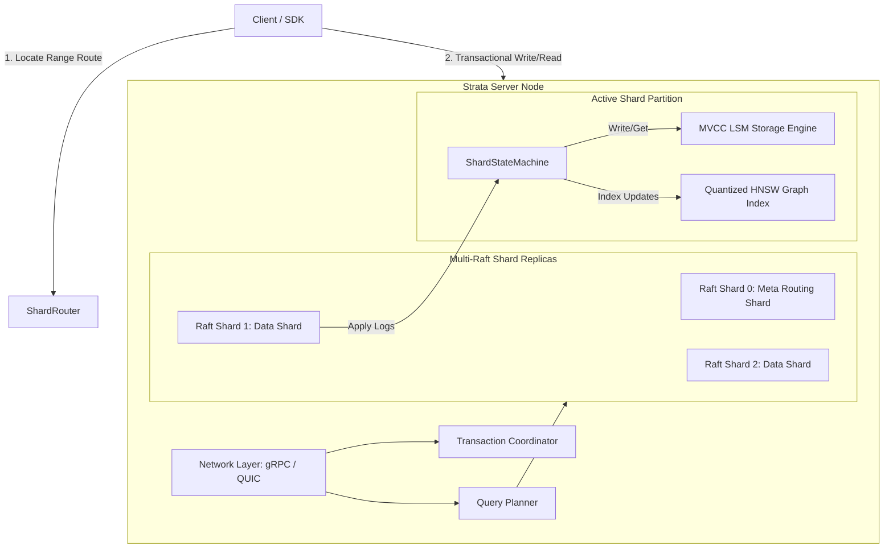

# STRATA 🚀

[](https://www.rust-lang.org/)
[](https://tokio.rs/)
[](https://opensource.org/licenses/MIT)

STRATA is a consensus-native, distributed vector database built entirely from scratch in Rust. It integrates custom hybrid logical clock (HLC) multi-version concurrency control (MVCC) storage, sharded Raft consensus with dynamic membership changes, SIMD-accelerated distance metrics, and quantized approximate nearest neighbor (ANN) search. 

STRATA is not a wrapper around an existing database engine. It implements standard distributed systems patterns (such as Raft consensus, LSM storage, and Vamana graph layouts) from first principles. Its primary novel research contribution is a **Learned-Entry-Point HNSW extension** (Phase 12), which optimizes ANN search entry-point queries using ML-derived spatial predictors rather than static random entrance nodes.

---

## Workspace Architecture & Crate Flow

The diagram below details the data flow from client requests through range-based routing to concurrent Multi-Raft shard state machines:



---

## Workspace Roadmap & Implementation Status

| Phase | Description | Status | Target Crate(s) |
|---|---|---|---|
| **Phase 0** | Scaffold workspace, architecture designs, CI, TLA+ setup | **Completed** | (Root) |
| **Phase 1** | MVCC Storage Engine (Versioned Keys, LSM/WAL/SSTable) | **Completed** | `strata-storage` |
| **Phase 2** | Raft Consensus (Elections, Log Replication, Snapshot compaction) | **Completed** | `strata-consensus` |
| **Phase 3** | Range Sharding & Dynamic Membership (Joint Consensus, Splits/Merges) | **Completed** | `strata-sharding` |
| **Phase 4** | SIMD Kernels & Product Quantization (NEON/L2/Cosine, k-means++, ADC) | **Completed** | `strata-simd` |
| **Phase 5** | In-Memory HNSW Graph Index (Cosine/L2, NEON SIMD) | *Planned* | `strata-index`, `strata-simd` |
| **Phase 6** | Out-of-Core Vamana Graph Index (Mmap Graph Layout) | *Planned* | `strata-index` |
| **Phase 7** | Percolator Transactions (2PC, Lock resolution, HLC) | *Planned* | `strata-txn` |
| **Phase 8** | Query Planner & Client SDK (Routing, Merging KNNs) | *Planned* | `strata-planner`, `strata-client` |
| **Phase 9** | Network Layer (gRPC/QUIC, Node Server Daemon) | *Planned* | `strata-net`, `strata-server` |
| **Phase 10** | Benchmarks & Jepsen/Simulation Testing | *Planned* | `strata-bench`, `strata-fuzz` |
| **Phase 11** | TLA+ Verification of Rebalancing Protocol | *Planned* | `tla/` |
| **Phase 12** | Learned-Entry-Point HNSW Extension (Novel ANN optimization) | *Planned* | `strata-index` |

---

## Key Design Decisions & Tradeoffs

1. **Range-Based Sharding over Consistent Hashing**: 
   - *Tradeoff*: Consistent hashing distributes keys uniformly across nodes but scatters contiguous keys, requiring expensive scatter-gather operations for range scans.
   - *Decision*: We chose range-based partitioning `[start_key, end_key)`. While this requires active split/merge coordination and load rebalancing, it enables extremely fast local lexicographical range queries, which are critical for relational and structured vector metadata scans.
2. **MVCC from Day One**:
   - *Decision*: Versioning is embedded at the storage layer via Hybrid Logical Clock (HLC) timestamps. Rather than wrapping a single-version database in a concurrency layer later, building MVCC into the LSM storage format from the start ensures consistent, conflict-free snapshot reads under heavy write traffic.

---

## Honest Limitations

- **Transactions are not yet implemented**: While the MVCC layer supports versioned keys, distributed transactions (Percolator-style 2-Phase Commit) are scheduled for Phase 7. As of this commit, cross-shard atomic writes are not supported.
- **Vector search is not yet functional**: Phase 4 completes the Product Quantization (PQ) compression pipeline and SIMD distance functions, but the Graph Indices (Phases 5 & 6) have not started. High-dimensional ANN search queries are currently unavailable.

---

## Quickstart

### Build the Workspace
To compile the entire workspace, run:
```bash
cargo build --workspace
```

### Run Tests and Benchmarks
To execute the comprehensive unit, property, and acceptance tests:
```bash
cargo test --workspace
```

To run the custom SIMD distance and PQ-ADC recall benchmark suite:
```bash
cargo test -p strata-simd --test simd_tests test_run_benchmarks_and_quantize_curves -- --nocapture
```

### Run Multi-Node Cluster
To spin up a local multi-node test cluster of physical server daemons:
```bash
docker-compose up --build
```
*(Requires Docker Compose. Network integration scheduled in Phase 9).*
