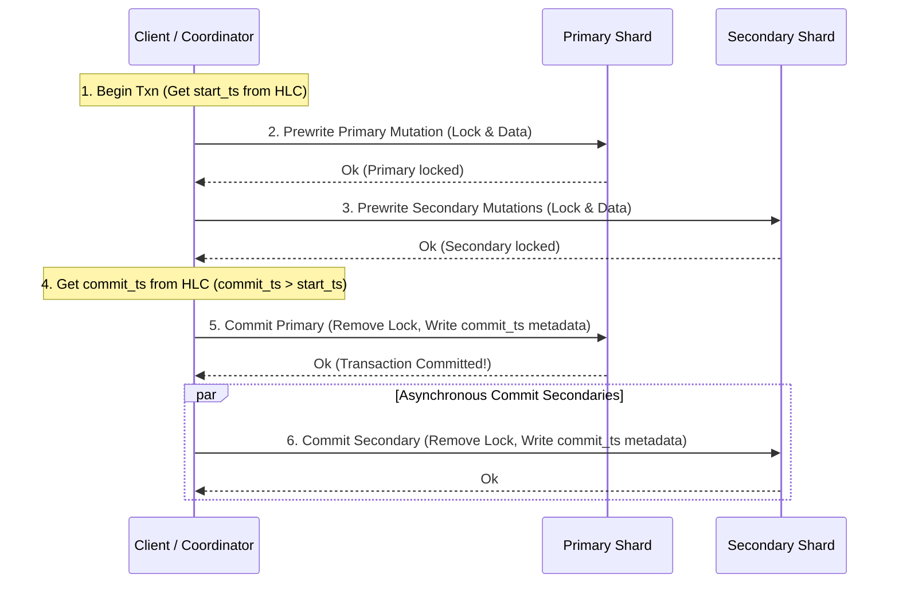

# STRATA Architecture

STRATA is a sharded distributed vector database written in Rust, targeted at Apple Silicon (using ARM NEON SIMD with scalar fallback, avoiding CUDA). This document outlines the core architecture, data flows, disk formats, and consensus mechanisms.

---

## 1. Data Flow

### Single-Shard Write (Put / Delete)
1. **Client Request**: The client issues a write request containing `(key, value, ts)` or a delete request `(key, ts)` targeting a specific key.
2. **Routing**: The client queries the `ShardRouter` to find the correct `ShardId` for the key (using consistent hashing).
3. **Consensus (Raft Proposals)**: The client routes the request to the leader of the Raft group managing that shard.
4. **Append Entries**: The Raft leader appends the write/delete command to its local log and broadcasts it to followers via `send_append_entries`.
5. **Commit & Apply**: Once a quorum has acknowledged the entry, the leader commits it and applies the command to its `StateMachine`.
6. **Storage Engine Put**: The `StateMachine` applies the write to the versioned local storage engine via the `Storage::put` or `Storage::delete` trait methods. The write is appended to the MemTable and WAL.
7. **Response**: A success response is returned to the client.

### Single-Shard Read (Get / Scan)
1. **Client Request**: The client issues a read request for a key as of a specific `HlcTimestamp`.
2. **Routing**: The client identifies the target shard via the `ShardRouter` and sends the query to a replica (or leader for linearizable read).
3. **Storage Engine Get**: The node queries the local `Storage` using `Storage::get(key, as_of)`.
4. **MVCC Resolution**: The storage engine scans versions of the key. It returns the value associated with the largest timestamp $T \le \text{as\_of}$. If the latest version at or before `as_of` is a deletion tombstone, or if no version exists, it returns `None`.
5. **Response**: The resolved value is returned.

---

## 2. Cross-Shard Transactions (Percolator-Style 2PC)

Cross-shard transactions use a distributed two-phase commit protocol based on Google Percolator, using Hybrid Logical Clock (HLC) timestamps to enforce snapshot isolation.

### Data Model Mutations
Every written key is associated with three structural columns/markers in the underlying versioned storage:
- `data`: Stores `(key, start_ts) -> value`
- `lock`: Stores `(key) -> lock_info` (which includes `primary_lock_key` and `lock_ts`)
- `write`: Stores `(key, commit_ts) -> start_ts`

### Transaction Lifecycle



1. **Begin**: Retrieve a start timestamp `start_ts` from the transaction coordinator's HLC.
2. **Prewrite**:
   - The coordinator designates one mutation as the **primary mutation** and others as **secondary mutations**.
   - It sends a prewrite request for the primary mutation to its shard. The shard checks for write conflicts (a committed write with $T_{commit} \ge T_{start}$) and lock conflicts (any active lock). If clean, it writes a lock pointing to itself and writes the temporary data versioned at `start_ts`.
   - It sends prewrite requests for the secondary mutations to their respective shards. Replicas write locks pointing to the *primary lock* and write data versioned at `start_ts`.
3. **Commit**:
   - The coordinator obtains a `commit_ts` (where $T_{commit} > T_{start}$).
   - It sends a commit request for the primary key to its shard. The shard verifies the primary lock is still active, removes the lock, and writes a commit record into the `write` column: `(key, commit_ts) -> start_ts`.
   - Once the primary commit succeeds, the transaction is logically committed.
   - The coordinator asynchronously commits secondary mutations by removing their locks and writing their commit records: `(key, commit_ts) -> start_ts`.

---

## 3. On-Disk SSTable Format

Versioned keys are periodically flushed from memory to disk SSTables.

### SSTable File Structure
```
+-----------------------------------+
|            File Header            | (Magic number, Version)
+-----------------------------------+
|                                   |
|            Data Blocks            | (Keys versioned with HLC timestamps)
|                                   |
+-----------------------------------+
|            Index Block            | (Key ranges & block offsets)
+-----------------------------------+
|           Filter Block            | (Bloom filter for quick key check)
+-----------------------------------+
|            File Footer            | (Offsets/lengths of Index & Filter)
+-----------------------------------+
```

### Data Block Layout
- Inside each Data Block, keys are serialized as:
  `[Key Length (u32)][Key Bytes][Timestamp Physical (u64)][Timestamp Logical (u32)][Type (Put/Delete)][Value Length (u32)][Value Bytes]`
- Keys are sorted lexicographically by user key, and then *descending* by timestamp. This layout ensures that a seek for a key at `as_of` can quickly locate the closest version at or below the target timestamp.

---

## 4. Raft State Machine Commands

The consensus layer applies replicated log entries to state machines. Each log entry is encoded in binary format (e.g., via `bincode` or `prost` Proto):

```rust
pub enum Command {
    Put {
        key: Vec<u8>,
        value: Vec<u8>,
        ts: HlcTimestamp,
    },
    Delete {
        key: Vec<u8>,
        ts: HlcTimestamp,
    },
    PrepareTxn {
        txn_id: Vec<u8>,
        mutations: Vec<Mutation>,
    },
    CommitTxn {
        txn_id: Vec<u8>,
        commit_ts: HlcTimestamp,
    },
    RollbackTxn {
        txn_id: Vec<u8>,
    },
}
```

State machine operations are deterministic. The state machine applies command payloads to update locks, versioned user data, and commit markers in the storage engine.

---

## 5. Vamana On-Disk Graph Layout

For out-of-core Approximate Nearest Neighbor (ANN) search, STRATA uses the Vamana graph algorithm. The graph is stored on disk to support memory-mapped execution.

### Graph File Format
```
+----------------------------------------+
|                 Header                 | (Num Points, Dimensions, Max Degree)
+----------------------------------------+
|                                        |
|              Point Record              | (Vector float values, user metadata u64)
|                                        |
+----------------------------------------+
|                                        |
|             Adjacency List             | (Neighbor IDs list)
|                                        |
+----------------------------------------+
```

Each index node is serialized in a contiguous chunk:
- `ID`: `u64`
- `Vector`: `[f32; D]` (where `D` is the dimension)
- `Neighbor Count`: `u32`
- `Neighbor IDs`: `[u64; max_degree]`

This format allows fast random access reads via `pread` or direct `mmap`, avoiding loading the entire graph into memory during queries.

---

## 6. Shard Routing Table Format

The routing table assigns key ranges or hashes to individual shard groups.

```rust
pub struct RouteEntry {
    pub start_key: Vec<u8>,      // start of range (inclusive)
    pub end_key: Vec<u8>,        // end of range (exclusive)
    pub shard_id: ShardId,       // logical shard
    pub raft_group: Vec<NodeId>, // nodes hosting this shard (leader/followers)
}
```

The router maintains a sorted list of `RouteEntry` objects. A key is routed by performing a binary search on the entries to find the range `[start_key, end_key)` that encompasses it. The table is updated dynamically when splits, merges, or rebalances occur.
